# Diagramas de Sequencia do MaphiApp
## 1. Inicializacao da aplicacao
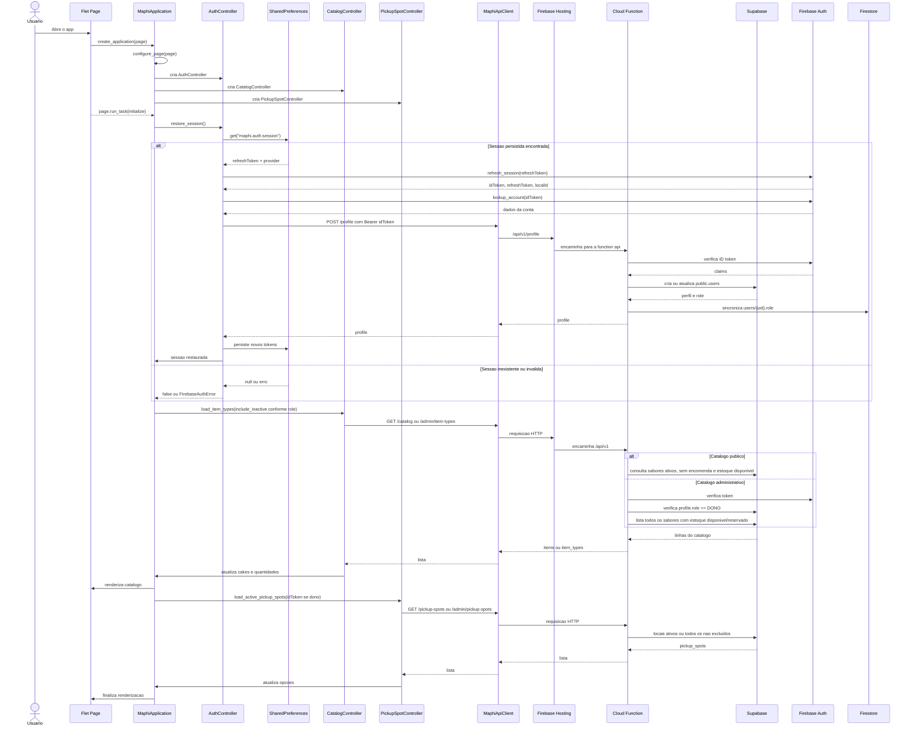
```mermaid
sequenceDiagram
    actor Usuario
    participant Flet as Flet Page
    participant App as MaphiApplication
    participant Auth as AuthController
    participant Storage as SharedPreferences
    participant Catalog as CatalogController
    participant Spots as PickupSpotController
    participant API as MaphiApiClient
    participant Hosting as Firebase Hosting
    participant Function as Cloud Function
    participant DB as Supabase

    Usuario->>Flet: Abre o app
    Flet->>App: create_application(page)
    App->>App: configure_page(page)
    App->>Auth: cria AuthController
    App->>Catalog: cria CatalogController
    App->>Spots: cria PickupSpotController
    Flet-->>App: page.run_task(initialize)

    App->>Auth: restore_session()
    Auth->>Storage: get("maphi.auth.session")
    alt Sessao persistida encontrada
        Storage-->>Auth: refreshToken + provider
        Auth->>Firebase Auth: refresh_session(refreshToken)
        Firebase Auth-->>Auth: idToken, refreshToken, localId
        Auth->>Firebase Auth: lookup_account(idToken)
        Firebase Auth-->>Auth: dados da conta
        Auth->>API: POST /profile com Bearer idToken
        API->>Hosting: /api/v1/profile
        Hosting->>Function: encaminha para a function api
        Function->>Firebase Auth: verifica ID token
        Firebase Auth-->>Function: claims
        Function->>DB: cria ou atualiza public.users
        DB-->>Function: perfil e role
        Function->>Firestore: sincroniza users/{uid}.role
        Function-->>API: profile
        API-->>Auth: profile
        Auth->>Storage: persiste novos tokens
        Auth->>App: sessao restaurada
    else Sessao inexistente ou invalida
        Storage-->>Auth: null ou erro
        Auth-->>App: false ou FirebaseAuthError
    end

    App->>Catalog: load_item_types(include_inactive conforme role)
    Catalog->>API: GET /catalog ou /admin/item-types
    API->>Hosting: requisicao HTTP
    Hosting->>Function: encaminha /api/v1
    alt Catalogo publico
        Function->>DB: consulta sabores ativos, sem encomenda e estoque disponivel
    else Catalogo administrativo
        Function->>Firebase Auth: verifica token
        Function->>DB: verifica profile.role == DONO
        Function->>DB: lista todos os sabores com estoque disponivel/reservado
    end
    DB-->>Function: linhas do catalogo
    Function-->>API: items ou item_types
    API-->>Catalog: lista
    Catalog->>App: atualiza cakes e quantidades
    App->>Flet: renderiza catalogo

    App->>Spots: load_active_pickup_spots(idToken se dono)
    Spots->>API: GET /pickup-spots ou /admin/pickup-spots
    API->>Function: requisicao HTTP
    Function->>DB: locais ativos ou todos os nao excluidos
    DB-->>Function: pickup_spots
    Function-->>API: lista
    API-->>Spots: lista
    Spots->>App: atualiza opcoes
    App->>Flet: finaliza renderizacao
```
## 2. Login com e-mail e senha
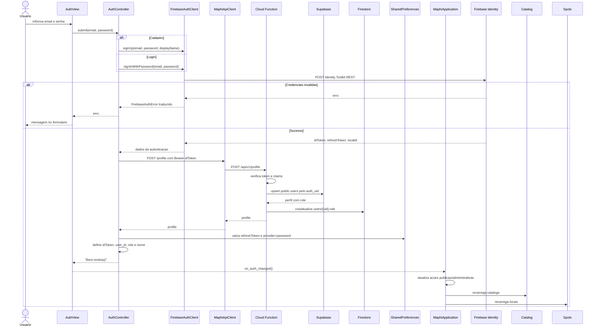
```mermaid
sequenceDiagram
    actor Usuario
    participant View as AuthView
    participant Auth as AuthController
    participant Firebase as FirebaseAuthClient
    participant API as MaphiApiClient
    participant Cloud as Cloud Function
    participant DB as Supabase
    participant Firestore
    participant Pref as SharedPreferences
    participant App as MaphiApplication

    Usuario->>View: informa email e senha
    View->>Auth: submit(email, password)
    alt Cadastro
        Auth->>Firebase: signUp(email, password, displayName)
    else Login
        Auth->>Firebase: signInWithPassword(email, password)
    end
    Firebase->>Firebase Identity: POST Identity Toolkit REST
    alt Credenciais invalidas
        Firebase Identity-->>Firebase: erro
        Firebase-->>Auth: FirebaseAuthError traduzido
        Auth-->>View: erro
        View-->>Usuario: mensagem no formulario
    else Sucesso
        Firebase Identity-->>Firebase: idToken, refreshToken, localId
        Firebase-->>Auth: dados da autenticacao
        Auth->>API: POST /profile com Bearer idToken
        API->>Cloud: POST /api/v1/profile
        Cloud->>Cloud: verifica token e claims
        Cloud->>DB: upsert public.users pelo auth_uid
        DB-->>Cloud: perfil com role
        Cloud->>Firestore: cria/atualiza users/{uid}.role
        Cloud-->>API: profile
        API-->>Auth: profile
        Auth->>Pref: salva refreshToken e provider=password
        Auth->>Auth: define idToken, user_id, role e nome
        Auth-->>View: "Bem-vindo(a)"
        View-->>App: on_auth_changed()
        App->>App: atualiza acoes publicas/administrativas
        App->>Catalog: recarrega catalogo
        App->>Spots: recarrega locais
    end
```
## 3. Login com Google
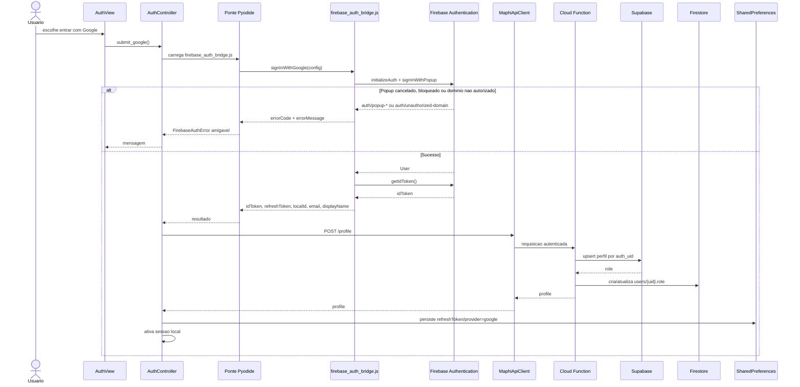
```mermaid
sequenceDiagram
    actor Usuario
    participant View as AuthView
    participant Auth as AuthController
    participant Pyodide as Ponte Pyodide
    participant JS as firebase_auth_bridge.js
    participant Firebase as Firebase Authentication
    participant API as MaphiApiClient
    participant Cloud as Cloud Function
    participant DB as Supabase
    participant Firestore
    participant Pref as SharedPreferences

    Usuario->>View: escolhe entrar com Google
    View->>Auth: submit_google()
    Auth->>Pyodide: carrega firebase_auth_bridge.js
    Pyodide->>JS: signInWithGoogle(config)
    JS->>Firebase: initializeAuth + signInWithPopup
    alt Popup cancelado, bloqueado ou dominio nao autorizado
        Firebase-->>JS: auth/popup-* ou auth/unauthorized-domain
        JS-->>Pyodide: errorCode + errorMessage
        Pyodide-->>Auth: FirebaseAuthError amigavel
        Auth-->>View: mensagem
    else Sucesso
        Firebase-->>JS: User
        JS->>Firebase: getIdToken()
        Firebase-->>JS: idToken
        JS-->>Pyodide: idToken, refreshToken, localId, email, displayName
        Pyodide-->>Auth: resultado
        Auth->>API: POST /profile
        API->>Cloud: requisicao autenticada
        Cloud->>DB: upsert perfil por auth_uid
        DB-->>Cloud: role
        Cloud->>Firestore: cria/atualiza users/{uid}.role
        Cloud-->>API: profile
        API-->>Auth: profile
        Auth->>Pref: persiste refreshToken/provider=google
        Auth->>Auth: ativa sessao local
    end
```
## 4. Logout
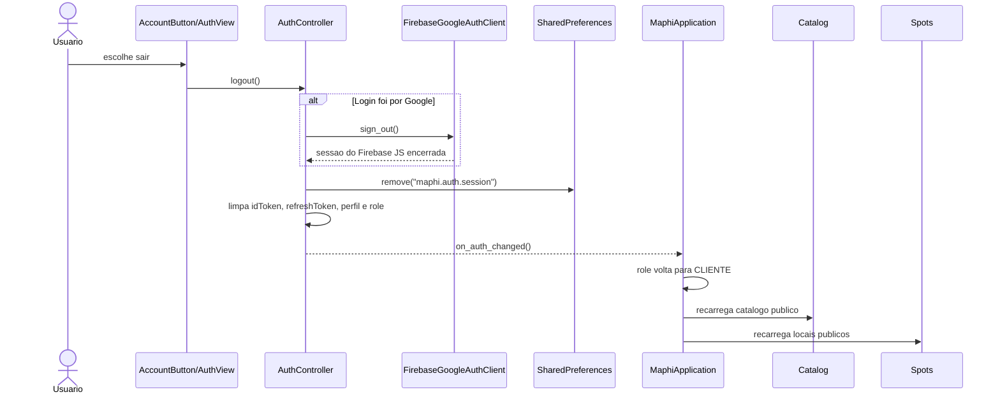
```mermaid
sequenceDiagram
    actor Usuario
    participant View as AccountButton/AuthView
    participant Auth as AuthController
    participant Google as FirebaseGoogleAuthClient
    participant Pref as SharedPreferences
    participant App as MaphiApplication

    Usuario->>View: escolhe sair
    View->>Auth: logout()
    alt Login foi por Google
        Auth->>Google: sign_out()
        Google-->>Auth: sessao do Firebase JS encerrada
    end
    Auth->>Pref: remove("maphi.auth.session")
    Auth->>Auth: limpa idToken, refreshToken, perfil e role
    Auth-->>App: on_auth_changed()
    App->>App: role volta para CLIENTE
    App->>Catalog: recarrega catalogo publico
    App->>Spots: recarrega locais publicos
```
## 5. Carregamento do catalogo publico
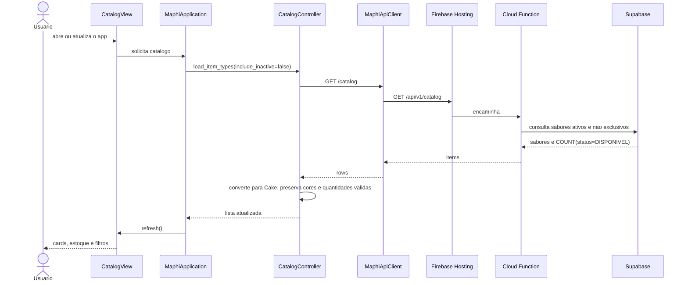
```mermaid
sequenceDiagram
    actor Usuario
    participant View as CatalogView
    participant App as MaphiApplication
    participant Controller as CatalogController
    participant API as MaphiApiClient
    participant Hosting as Firebase Hosting
    participant Cloud as Cloud Function
    participant DB as Supabase

    Usuario->>View: abre ou atualiza o app
    View->>App: solicita catalogo
    App->>Controller: load_item_types(include_inactive=false)
    Controller->>API: GET /catalog
    API->>Hosting: GET /api/v1/catalog
    Hosting->>Cloud: encaminha
    Cloud->>DB: consulta sabores ativos e nao exclusivos
    DB-->>Cloud: sabores e COUNT(status=DISPONIVEL)
    Cloud-->>API: items
    API-->>Controller: rows
    Controller->>Controller: converte para Cake, preserva cores e quantidades validas
    Controller-->>App: lista atualizada
    App->>View: refresh()
    View-->>Usuario: cards, estoque e filtros
```
## 6. Criacao atomica de reserva
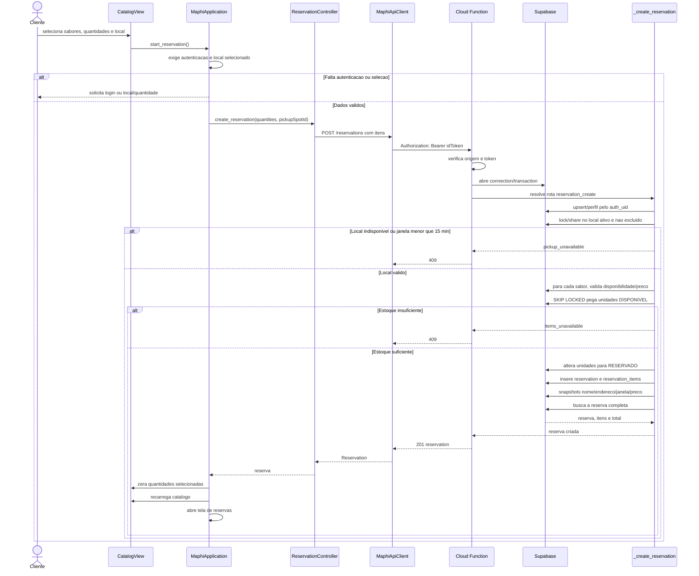
```mermaid
sequenceDiagram
    actor Cliente
    participant Catalog as CatalogView
    participant App as MaphiApplication
    participant RC as ReservationController
    participant API as MaphiApiClient
    participant Cloud as Cloud Function
    participant DB as Supabase
    participant Reserva as _create_reservation

    Cliente->>Catalog: seleciona sabores, quantidades e local
    Catalog->>App: start_reservation()
    App->>App: exige autenticacao e local selecionado
    alt Falta autenticacao ou selecao
        App-->>Cliente: solicita login ou local/quantidade
    else Dados validos
        App->>RC: create_reservation(quantities, pickupSpotId)
        RC->>API: POST /reservations com itens
        API->>Cloud: Authorization: Bearer idToken
        Cloud->>Cloud: verifica origem e token
        Cloud->>DB: abre connection/transaction
        Cloud->>Reserva: resolve rota reservation_create
        Reserva->>DB: upsert/perfil pelo auth_uid
        Reserva->>DB: lock/share no local ativo e nao excluido
        alt Local indisponivel ou janela menor que 15 min
            Reserva-->>Cloud: pickup_unavailable
            Cloud-->>API: 409
        else Local valido
            Reserva->>DB: para cada sabor, valida disponibilidade/preco
            Reserva->>DB: SKIP LOCKED pega unidades DISPONIVEL
            alt Estoque insuficiente
                Reserva-->>Cloud: items_unavailable
                Cloud-->>API: 409
            else Estoque suficiente
                Reserva->>DB: altera unidades para RESERVADO
                Reserva->>DB: insere reservation e reservation_items
                Reserva->>DB: snapshots nome/endereco/janela/preco
                Reserva->>DB: busca a reserva completa
                DB-->>Reserva: reserva, itens e total
                Reserva-->>Cloud: reserva criada
                Cloud-->>API: 201 reservation
                API-->>RC: Reservation
                RC-->>App: reserva
                App->>Catalog: zera quantidades selecionadas
                App->>Catalog: recarrega catalogo
                App->>App: abre tela de reservas
            end
        end
    end
```
## 7. Listagem de reservas
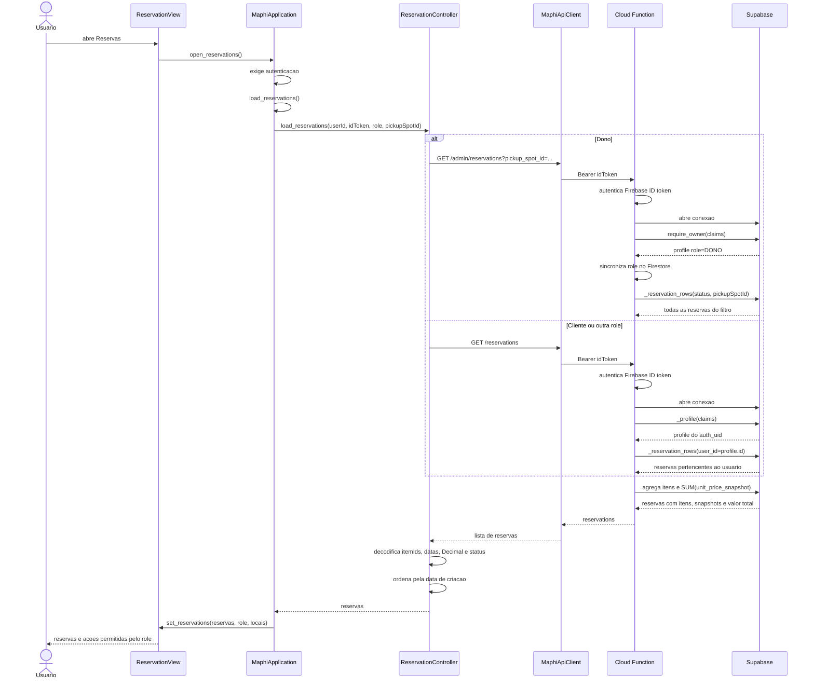
```mermaid
sequenceDiagram
    actor Usuario
    participant View as ReservationView
    participant App as MaphiApplication
    participant RC as ReservationController
    participant API as MaphiApiClient
    participant Cloud as Cloud Function
    participant DB as Supabase

    Usuario->>View: abre Reservas
    View->>App: open_reservations()
    App->>App: exige autenticacao
    App->>App: load_reservations()
    App->>RC: load_reservations(userId, idToken, role, pickupSpotId)

    alt Dono
        RC->>API: GET /admin/reservations?pickup_spot_id=...
        API->>Cloud: Bearer idToken
        Cloud->>Cloud: autentica Firebase ID token
        Cloud->>DB: abre conexao
        Cloud->>DB: require_owner(claims)
        DB-->>Cloud: profile role=DONO
        Cloud->>Cloud: sincroniza role no Firestore
        Cloud->>DB: _reservation_rows(status, pickupSpotId)
        DB-->>Cloud: todas as reservas do filtro
    else Cliente ou outra role
        RC->>API: GET /reservations
        API->>Cloud: Bearer idToken
        Cloud->>Cloud: autentica Firebase ID token
        Cloud->>DB: abre conexao
        Cloud->>DB: _profile(claims)
        DB-->>Cloud: profile do auth_uid
        Cloud->>DB: _reservation_rows(user_id=profile.id)
        DB-->>Cloud: reservas pertencentes ao usuario
    end

    Cloud->>DB: agrega itens e SUM(unit_price_snapshot)
    DB-->>Cloud: reservas com itens, snapshots e valor total
    Cloud-->>API: reservations
    API-->>RC: lista de reservas
    RC->>RC: decodifica itemIds, datas, Decimal e status
    RC->>RC: ordena pela data de criacao
    RC-->>App: reservas
    App->>View: set_reservations(reservas, role, locais)
    View-->>Usuario: reservas e acoes permitidas pelo role
```
## 8. Cancelamento de reserva
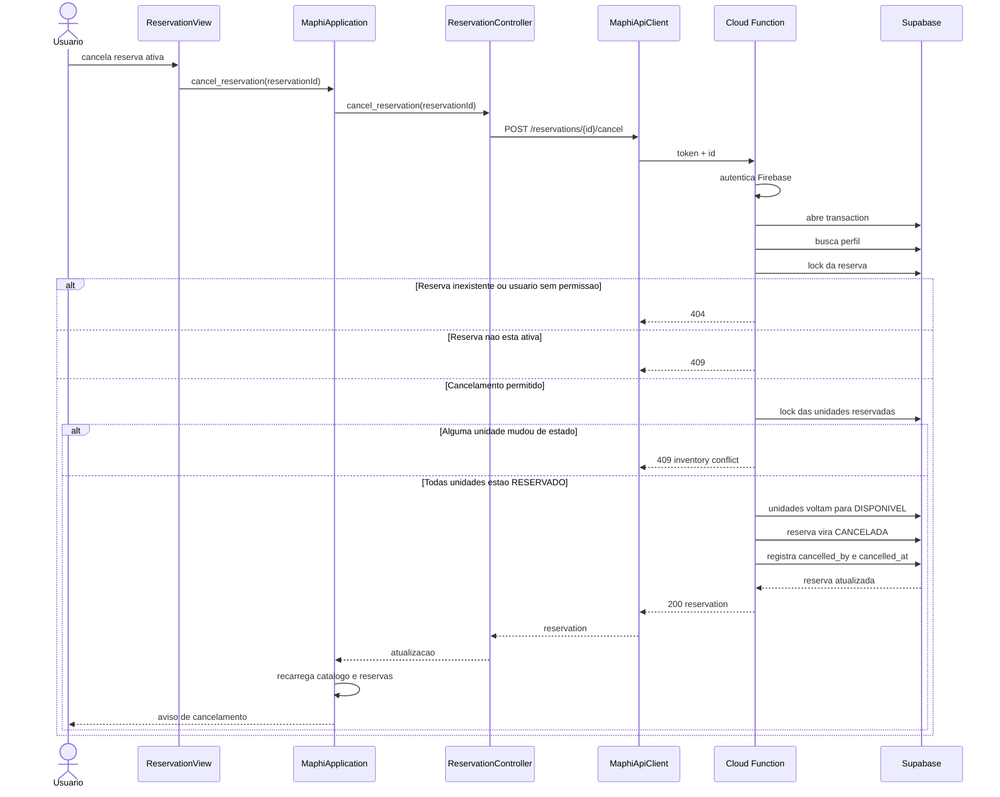
```mermaid
sequenceDiagram
    actor Usuario
    participant View as ReservationView
    participant App as MaphiApplication
    participant RC as ReservationController
    participant API as MaphiApiClient
    participant Cloud as Cloud Function
    participant DB as Supabase

    Usuario->>View: cancela reserva ativa
    View->>App: cancel_reservation(reservationId)
    App->>RC: cancel_reservation(reservationId)
    RC->>API: POST /reservations/{id}/cancel
    API->>Cloud: token + id
    Cloud->>Cloud: autentica Firebase
    Cloud->>DB: abre transaction
    Cloud->>DB: busca perfil
    Cloud->>DB: lock da reserva
    alt Reserva inexistente ou usuario sem permissao
        Cloud-->>API: 404
    else Reserva nao esta ativa
        Cloud-->>API: 409
    else Cancelamento permitido
        Cloud->>DB: lock das unidades reservadas
        alt Alguma unidade mudou de estado
            Cloud-->>API: 409 inventory conflict
        else Todas unidades estao RESERVADO
            Cloud->>DB: unidades voltam para DISPONIVEL
            Cloud->>DB: reserva vira CANCELADA
            Cloud->>DB: registra cancelled_by e cancelled_at
            DB-->>Cloud: reserva atualizada
            Cloud-->>API: 200 reservation
            API-->>RC: reservation
            RC-->>App: atualizacao
            App->>App: recarrega catalogo e reservas
            App-->>Usuario: aviso de cancelamento
        end
    end
```
## 9. Conclusao administrativa da venda
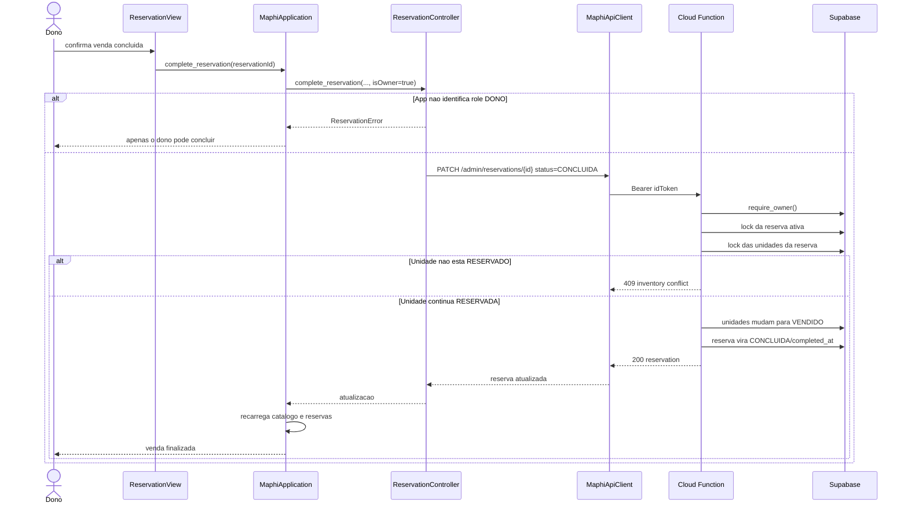
```mermaid
sequenceDiagram
    actor Dono
    participant View as ReservationView
    participant App as MaphiApplication
    participant RC as ReservationController
    participant API as MaphiApiClient
    participant Cloud as Cloud Function
    participant DB as Supabase

    Dono->>View: confirma venda concluida
    View->>App: complete_reservation(reservationId)
    App->>RC: complete_reservation(..., isOwner=true)
    alt App nao identifica role DONO
        RC-->>App: ReservationError
        App-->>Dono: apenas o dono pode concluir
    else
        RC->>API: PATCH /admin/reservations/{id} status=CONCLUIDA
        API->>Cloud: Bearer idToken
        Cloud->>DB: require_owner()
        Cloud->>DB: lock da reserva ativa
        Cloud->>DB: lock das unidades da reserva
        alt Unidade nao esta RESERVADO
            Cloud-->>API: 409 inventory conflict
        else Unidade continua RESERVADA
            Cloud->>DB: unidades mudam para VENDIDO
            Cloud->>DB: reserva vira CONCLUIDA/completed_at
            Cloud-->>API: 200 reservation
            API-->>RC: reserva atualizada
            RC-->>App: atualizacao
            App->>App: recarrega catalogo e reservas
            App-->>Dono: venda finalizada
        end
    end
```
## 10. Criacao e remocao de estoque pelo dono
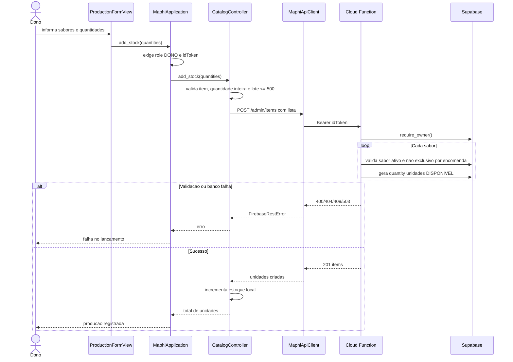
```mermaid
sequenceDiagram
    actor Dono
    participant View as ProductionFormView
    participant App as MaphiApplication
    participant Catalog as CatalogController
    participant API as MaphiApiClient
    participant Cloud as Cloud Function
    participant DB as Supabase

    Dono->>View: informa sabores e quantidades
    View->>App: add_stock(quantities)
    App->>App: exige role DONO e idToken
    App->>Catalog: add_stock(quantities)
    Catalog->>Catalog: valida item, quantidade inteira e lote <= 500
    Catalog->>API: POST /admin/items com lista
    API->>Cloud: Bearer idToken
    Cloud->>DB: require_owner()
    loop Cada sabor
        Cloud->>DB: valida sabor ativo e nao exclusivo por encomenda
        Cloud->>DB: gera quantity unidades DISPONIVEL
    end
    alt Validacao ou banco falha
        Cloud-->>API: 400/404/409/503
        API-->>Catalog: FirebaseRestError
        Catalog-->>App: erro
        App-->>Dono: falha no lancamento
    else Sucesso
        Cloud-->>API: 201 items
        API-->>Catalog: unidades criadas
        Catalog->>Catalog: incrementa estoque local
        Catalog-->>App: total de unidades
        App-->>Dono: producao registrada
    end
```
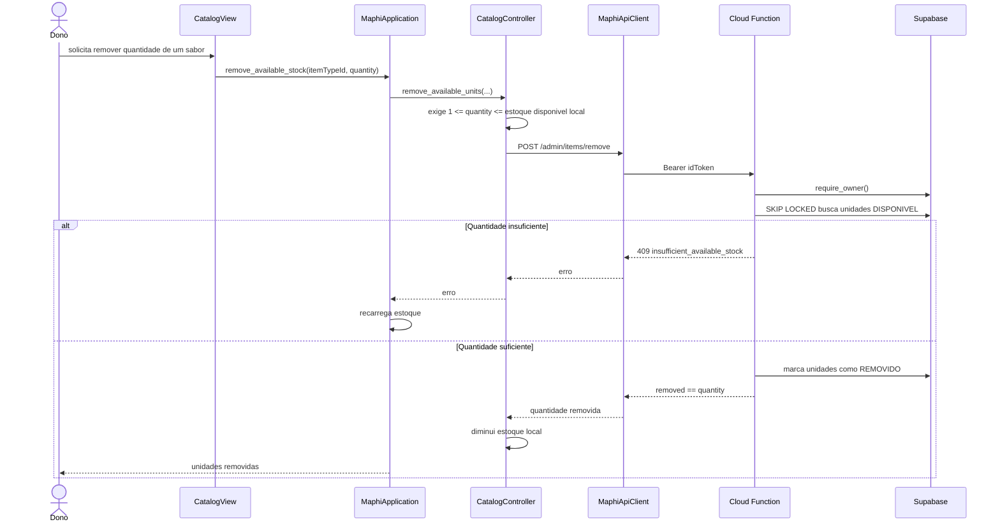
```mermaid
sequenceDiagram
    actor Dono
    participant View as CatalogView
    participant App as MaphiApplication
    participant Catalog as CatalogController
    participant API as MaphiApiClient
    participant Cloud as Cloud Function
    participant DB as Supabase

    Dono->>View: solicita remover quantidade de um sabor
    View->>App: remove_available_stock(itemTypeId, quantity)
    App->>Catalog: remove_available_units(...)
    Catalog->>Catalog: exige 1 <= quantity <= estoque disponivel local
    Catalog->>API: POST /admin/items/remove
    API->>Cloud: Bearer idToken
    Cloud->>DB: require_owner()
    Cloud->>DB: SKIP LOCKED busca unidades DISPONIVEL
    alt Quantidade insuficiente
        Cloud-->>API: 409 insufficient_available_stock
        API-->>Catalog: erro
        Catalog-->>App: erro
        App->>App: recarrega estoque
    else Quantidade suficiente
        Cloud->>DB: marca unidades como REMOVIDO
        Cloud-->>API: removed == quantity
        API-->>Catalog: quantidade removida
        Catalog->>Catalog: diminui estoque local
        App-->>Dono: unidades removidas
    end
```
## 11. CRUD de sabores e upload de imagem
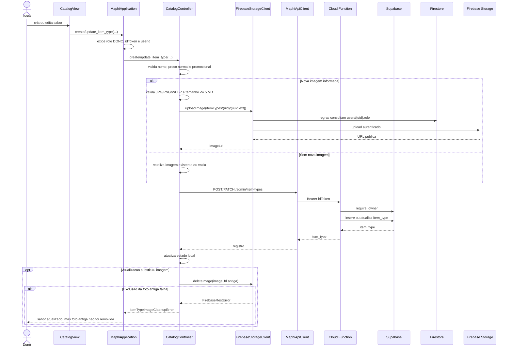
```mermaid
sequenceDiagram
    actor Dono
    participant View as CatalogView
    participant App as MaphiApplication
    participant Catalog as CatalogController
    participant Storage as FirebaseStorageClient
    participant API as MaphiApiClient
    participant Cloud as Cloud Function
    participant DB as Supabase
    participant Firestore

    Dono->>View: cria ou edita sabor
    View->>App: create/update_item_type(...)
    App->>App: exige role DONO, idToken e userId
    App->>Catalog: create/update_item_type(...)
    Catalog->>Catalog: valida nome, preco normal e promocional
    alt Nova imagem informada
        Catalog->>Catalog: valida JPG/PNG/WEBP e tamanho <= 5 MB
        Catalog->>Storage: uploadImage(itemTypes/{uid}/{uuid.ext})
        Storage->>Firestore: regras consultam users/{uid}.role
        Storage->>Firebase Storage: upload autenticado
        Firebase Storage-->>Storage: URL publica
        Storage-->>Catalog: imageUrl
    else Sem nova imagem
        Catalog->>Catalog: reutiliza imagem existente ou vazia
    end
    Catalog->>API: POST/PATCH /admin/item-types
    API->>Cloud: Bearer idToken
    Cloud->>DB: require_owner
    Cloud->>DB: insere ou atualiza item_type
    DB-->>Cloud: item_type
    Cloud-->>API: item_type
    API-->>Catalog: registro
    Catalog->>Catalog: atualiza estado local

    opt Atualizacao substituiu imagem
        Catalog->>Storage: deleteImage(imageUrl antiga)
        alt Exclusao da foto antiga falha
            Storage-->>Catalog: FirebaseRestError
            Catalog-->>App: ItemTypeImageCleanupError
            App-->>Dono: sabor atualizado, mas foto antiga nao foi removida
        end
    end
```
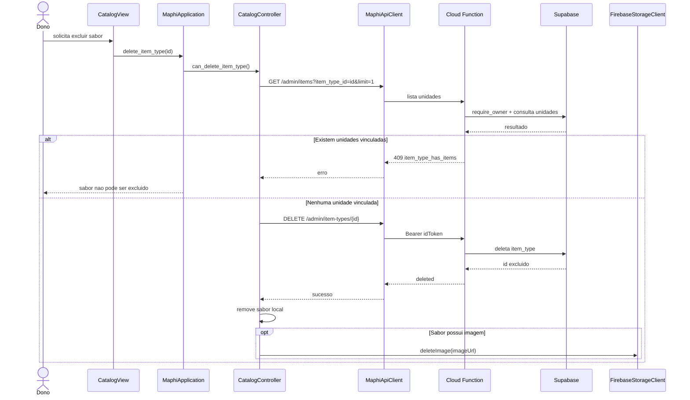
```mermaid
sequenceDiagram
    actor Dono
    participant View as CatalogView
    participant App as MaphiApplication
    participant Catalog as CatalogController
    participant API as MaphiApiClient
    participant Cloud as Cloud Function
    participant DB as Supabase
    participant Storage as FirebaseStorageClient

    Dono->>View: solicita excluir sabor
    View->>App: delete_item_type(id)
    App->>Catalog: can_delete_item_type()
    Catalog->>API: GET /admin/items?item_type_id=id&limit=1
    API->>Cloud: lista unidades
    Cloud->>DB: require_owner + consulta unidades
    DB-->>Cloud: resultado
    alt Existem unidades vinculadas
        Cloud-->>API: 409 item_type_has_items
        API-->>Catalog: erro
        App-->>Dono: sabor nao pode ser excluido
    else Nenhuma unidade vinculada
        Catalog->>API: DELETE /admin/item-types/{id}
        API->>Cloud: Bearer idToken
        Cloud->>DB: deleta item_type
        DB-->>Cloud: id excluido
        Cloud-->>API: deleted
        API-->>Catalog: sucesso
        Catalog->>Catalog: remove sabor local
        opt Sabor possui imagem
            Catalog->>Storage: deleteImage(imageUrl)
        end
    end
```
## 12. CRUD de locais de retirada
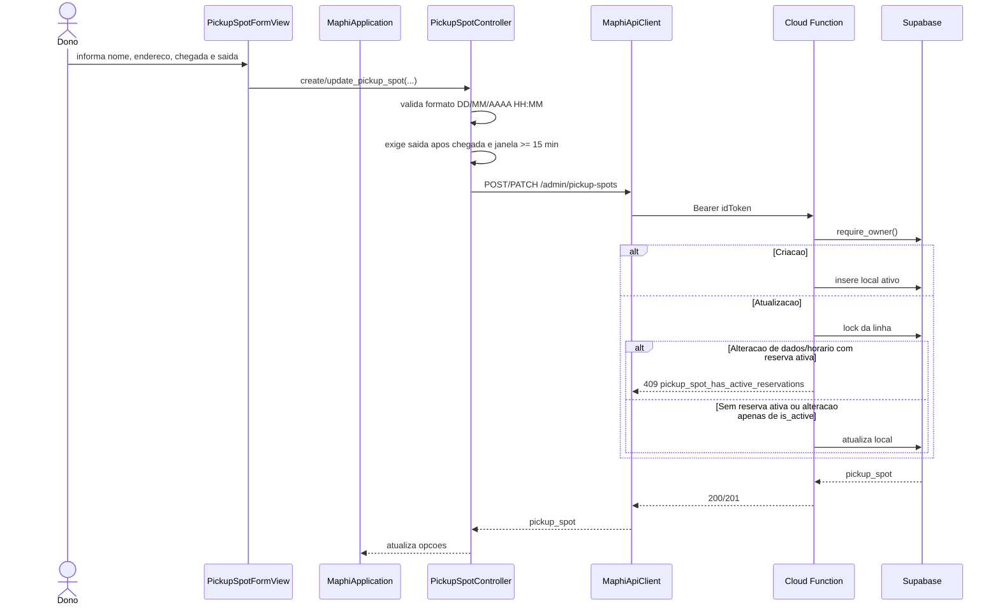
```mermaid
sequenceDiagram
    actor Dono
    participant View as PickupSpotFormView
    participant App as MaphiApplication
    participant Spots as PickupSpotController
    participant API as MaphiApiClient
    participant Cloud as Cloud Function
    participant DB as Supabase

    Dono->>View: informa nome, endereco, chegada e saida
    View->>Spots: create/update_pickup_spot(...)
    Spots->>Spots: valida formato DD/MM/AAAA HH:MM
    Spots->>Spots: exige saida apos chegada e janela >= 15 min
    Spots->>API: POST/PATCH /admin/pickup-spots
    API->>Cloud: Bearer idToken
    Cloud->>DB: require_owner()
    alt Criacao
        Cloud->>DB: insere local ativo
    else Atualizacao
        Cloud->>DB: lock da linha
        alt Alteracao de dados/horario com reserva ativa
            Cloud-->>API: 409 pickup_spot_has_active_reservations
        else Sem reserva ativa ou alteracao apenas de is_active
            Cloud->>DB: atualiza local
        end
    end
    DB-->>Cloud: pickup_spot
    Cloud-->>API: 200/201
    API-->>Spots: pickup_spot
    Spots-->>App: atualiza opcoes
```
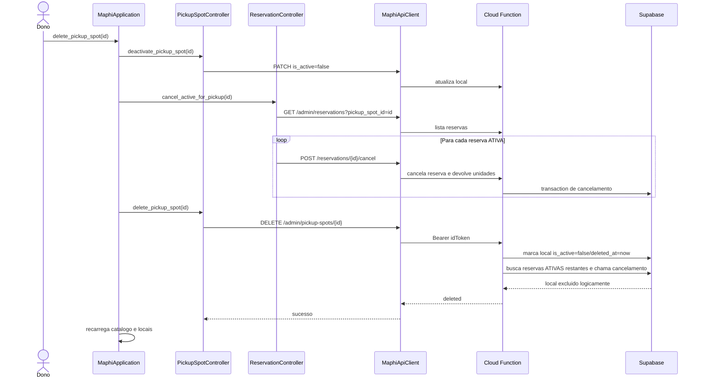
```mermaid
sequenceDiagram
    actor Dono
    participant App as MaphiApplication
    participant Spots as PickupSpotController
    participant RC as ReservationController
    participant API as MaphiApiClient
    participant Cloud as Cloud Function
    participant DB as Supabase

    Dono->>App: delete_pickup_spot(id)
    App->>Spots: deactivate_pickup_spot(id)
    Spots->>API: PATCH is_active=false
    API->>Cloud: atualiza local
    App->>RC: cancel_active_for_pickup(id)
    RC->>API: GET /admin/reservations?pickup_spot_id=id
    API->>Cloud: lista reservas
    loop Para cada reserva ATIVA
        RC->>API: POST /reservations/{id}/cancel
        API->>Cloud: cancela reserva e devolve unidades
        Cloud->>DB: transaction de cancelamento
    end
    App->>Spots: delete_pickup_spot(id)
    Spots->>API: DELETE /admin/pickup-spots/{id}
    API->>Cloud: Bearer idToken
    Cloud->>DB: marca local is_active=false/deleted_at=now
    Cloud->>DB: busca reservas ATIVAS restantes e chama cancelamento
    DB-->>Cloud: local excluido logicamente
    Cloud-->>API: deleted
    API-->>Spots: sucesso
    App->>App: recarrega catalogo e locais
```
## 13. Exclusao administrativa de reserva
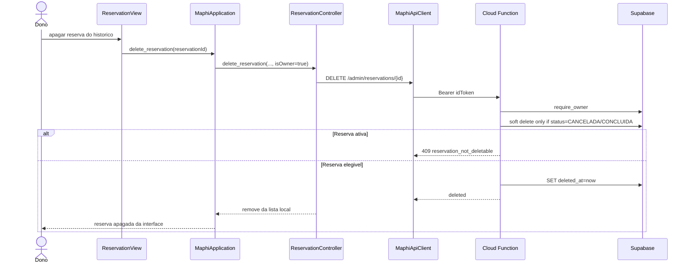
```mermaid
sequenceDiagram
    actor Dono
    participant View as ReservationView
    participant App as MaphiApplication
    participant RC as ReservationController
    participant API as MaphiApiClient
    participant Cloud as Cloud Function
    participant DB as Supabase

    Dono->>View: apagar reserva do historico
    View->>App: delete_reservation(reservationId)
    App->>RC: delete_reservation(..., isOwner=true)
    RC->>API: DELETE /admin/reservations/{id}
    API->>Cloud: Bearer idToken
    Cloud->>DB: require_owner
    Cloud->>DB: soft delete only if status=CANCELADA/CONCLUIDA
    alt Reserva ativa
        Cloud-->>API: 409 reservation_not_deletable
    else Reserva elegivel
        Cloud->>DB: SET deleted_at=now
        Cloud-->>API: deleted
        RC-->>App: remove da lista local
        App-->>Dono: reserva apagada da interface
    end
```
## 14. Dispatch da Cloud Function
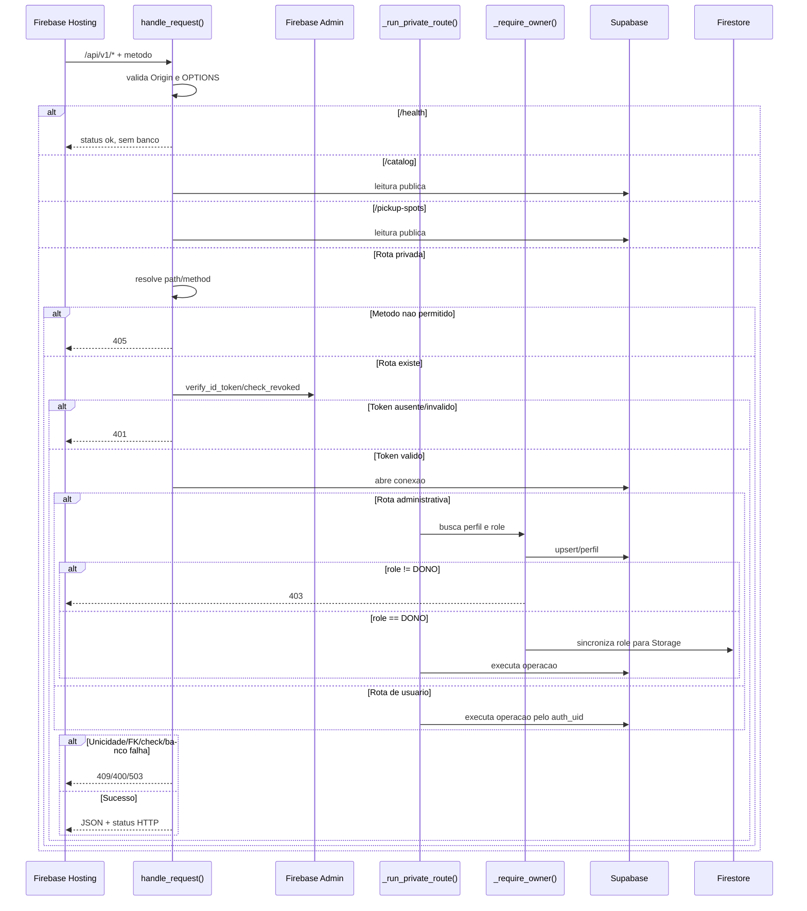
```mermaid
sequenceDiagram
    participant Host as Firebase Hosting
    participant Function as handle_request()
    participant Auth as Firebase Admin
    participant Route as _run_private_route()
    participant Owner as _require_owner()
    participant DB as Supabase
    participant Firestore

    Host->>Function: /api/v1/* + metodo
    Function->>Function: valida Origin e OPTIONS
    alt /health
        Function-->>Host: status ok, sem banco
    else /catalog
        Function->>DB: leitura publica
    else /pickup-spots
        Function->>DB: leitura publica
    else Rota privada
        Function->>Function: resolve path/method
        alt Metodo nao permitido
            Function-->>Host: 405
        else Rota existe
            Function->>Auth: verify_id_token/check_revoked
            alt Token ausente/invalido
                Function-->>Host: 401
            else Token valido
                Function->>DB: abre conexao
                alt Rota administrativa
                    Route->>Owner: busca perfil e role
                    Owner->>DB: upsert/perfil
                    alt role != DONO
                        Owner-->>Host: 403
                    else role == DONO
                        Owner->>Firestore: sincroniza role para Storage
                        Route->>DB: executa operacao
                    end
                else Rota de usuario
                    Route->>DB: executa operacao pelo auth_uid
                end
                alt Unicidade/FK/check/banco falha
                    Function-->>Host: 409/400/503
                else Sucesso
                    Function-->>Host: JSON + status HTTP
                end
            end
        end
    end
```
## 15. Pipeline CI/CD
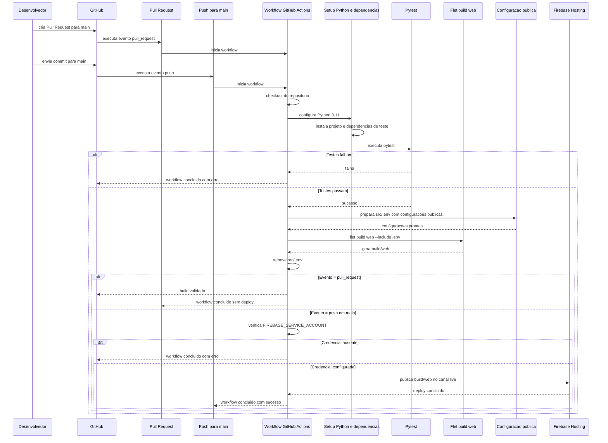
```mermaid
sequenceDiagram
    participant Dev as Desenvolvedor
    participant Git as GitHub
    participant PR as Pull Request
    participant Push as Push para main
    participant Actions as Workflow GitHub Actions
    participant Setup as Setup Python e dependencias
    participant Test as Pytest
    participant Build as Flet build web
    participant Env as Configuracao publica
    participant Firebase as Firebase Hosting

    Dev->>Git: cria Pull Request para main
    Git->>PR: executa evento pull_request
    PR->>Actions: inicia workflow

    Dev->>Git: envia commit para main
    Git->>Push: executa evento push
    Push->>Actions: inicia workflow

    Actions->>Actions: checkout do repositorio
    Actions->>Setup: configura Python 3.11
    Setup->>Setup: instala projeto e dependencias de teste
    Setup->>Test: executa pytest

    alt Testes falham
        Test-->>Actions: falha
        Actions-->>Git: workflow concluido com erro
    else Testes passam
        Test-->>Actions: sucesso
        Actions->>Env: prepara src/.env com configuracoes publicas
        Env-->>Actions: configuracoes prontas
        Actions->>Build: flet build web --include .env
        Build-->>Actions: gera build/web
        Actions->>Actions: remove src/.env

        alt Evento = pull_request
            Actions-->>Git: build validado
            Actions-->>PR: workflow concluido sem deploy
        else Evento = push em main
            Actions->>Actions: verifica FIREBASE_SERVICE_ACCOUNT
            alt Credencial ausente
                Actions-->>Git: workflow concluido com erro
            else Credencial configurada
                Actions->>Firebase: publica build/web no canal live
                Firebase-->>Actions: deploy concluido
                Actions-->>Push: workflow concluido com sucesso
            end
        end
    end
```
